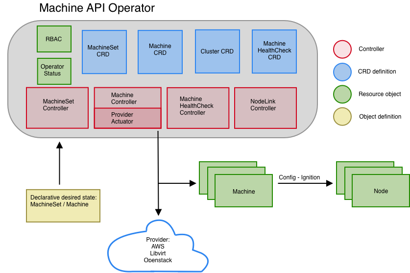

# Machine API Operator
The Machine API Operator manages the lifecycle of specific purpose CRDs, controllers and RBAC objects that extend the Kubernetes API.
This allows to convey desired state of machines in a cluster in a declarative fashion.

## Architecture


## CRDs
- MachineSet
- Machine
- Cluster
- MachineHealthCheck

## Controllers
### Cluster API controllers
- [MachineSet Controller](https://github.com/kubernetes-sigs/cluster-api/tree/master/pkg/controller)
  - Reconciles desired state for [MachineSets](https://github.com/kubernetes-sigs/cluster-api/blob/master/pkg/apis/cluster/v1alpha1/machineset_types.go) by ensuring presence of specified number of replicas and config for a set of machines.

- [Machine Controller](https://github.com/kubernetes-sigs/cluster-api/tree/master/pkg/controller)
  - Reconciles desired state for [Machines](https://github.com/kubernetes-sigs/cluster-api/blob/master/pkg/apis/cluster/v1alpha1/machine_types.go) by ensuring that instances with a desired config exist in a given cloud provider. Currently we support:

  - [cluster-api-provider-aws](https://github.com/openshift/cluster-api-provider-aws)

  - [cluster-api-provider-libvirt](https://github.com/openshift/cluster-api-provider-libvirt)

  - [cluster-api-provider-openstack](https://github.com/kubernetes-sigs/cluster-api-provider-openstack). Coming soon.

- [Node Controller](https://github.com/kubernetes-sigs/cluster-api/tree/master/pkg/controller)
  - Reconciles desired state of machines by matching IP addresses of machine objects with IP addresses of node objects. Annotating node with a special label containing machine name that the cluster-api node controller interprets and sets corresponding nodeRef field of each relevant machine.

### Nodelink controller
- Reconciles desired state of machines by matching IP addresses of machine objects with IP addresses of node objects and annotates nodes with a special [machine annotation](https://github.com/kubernetes-sigs/cluster-api/blob/master/pkg/controller/node/node.go#L35) containing the machine name. The cluster-api node controller interprets the annotation and sets the corresponding nodeRef field of each relevant machine.

- Build:
```
$ make nodelink-controller
```
### Machine healthcheck controller
- Reconciles desired state for [MachineHealthChecks](https://github.com/openshift/machine-api-operator/blob/master/pkg/apis/healthchecking/v1alpha1/machinehealthcheck_types.go) by ensuring that machines targeted by machineHealthCheck objects are healthy or remediated otherwise.

- Build:
```
$ make machine-healthcheck
```

## Dev
- Build:
    ```sh
    $ make build
    ```
- Run:
    ```sh
    $ ./bin/machine-api-operator --kubeconfig ${HOME}/.kube/config --images-json=pkg/operator/fixtures/images.json
    ```
- Image:
    ```
    $ make image
    ```

The Machine API Operator is designed to work in conjunction with the [Cluster Version Operator](https://github.com/openshift/cluster-version-operator).
You can see it in action by running an [OpenShift Cluster deployed by the Installer](https://github.com/openshift/installer).

However you can run it in a vanilla Kubernetes cluster by precreating some assets:

- Create a `openshift-machine-api-operator` namespace
- Create a [CRD Status definition](test/integration/manifests/status-crd.yaml)
- Create a [CRD Machine definition](test/integration/manifests/0000_50_machine-api-operator_02_machine.crd.yaml)
- Create a [CRD MachineSet definition](test/integration/manifests/0000_50_machine-api-operator_03_machineset.crd.yaml)
- Create a [CRD MachineDeployment definition](test/integration/manifests/0000_50_machine-api-operator_04_machinedeployment.crd.yaml)
- Create a [CRD Cluster definition](test/integration/manifests/0000_50_machine-api-operator_05_cluster.crd.yaml)
- Create a [Installer config](test/integration/manifests/install-config.yaml)
- Then you can run it as a [deployment](install/0000_50_machine-api-operator_08_deployment.yaml)
- You should then be able to deploy a [cluster](test/integration/manifests/cluster.yaml) and a [machineSet](test/integration/manifests/machineset.yaml) object

## CI & tests

Run unit test:
```
$ make test
```

Run e2e-aws-operator tests. This tests assume that a cluster deployed by the Installer is up and running and a ```KUBECONFIG``` environment variable is set:
```
$ make test-e2e
```

Tests are located under [machine-api-operator repository][1] and executed in prow CI system. A link to failing tests is published as a comment in PR by `@openshift-ci-robot`. Current test status for all OpenShift components can be found in https://deck-ci.svc.ci.openshift.org.

CI configuration is stored under [openshift/release][2] repository and is split into 4 files:
  - [cluster/ci/config/prow/plugins.yaml][3] - says which prow plugins are available and where job config is stored
  - [ci-operator/config/openshift/machine-api-operator/master.yaml][4] - configuration for machine-api-operator component repository
  - [ci-operator/jobs/openshift/machine-api-operator/openshift-machine-api-operator-master-presubmits.yaml][5] - prow jobs configuration for presubmits
  - [ci-operator/jobs/openshift/machine-api-operator/openshift-machine-api-operator-master-postsubmits.yaml][6] - prow jobs configuration for postsubmits

More information about those files can be found in [ci-operator onboarding file][7].

[1]: https://github.com/openshift/machine-api-operator
[2]: https://github.com/openshift/release
[3]: https://github.com/openshift/release/blob/master/cluster/ci/config/prow/plugins.yaml
[4]: https://github.com/openshift/release/blob/master/ci-operator/config/openshift/machine-api-operator/master.yaml
[5]: https://github.com/openshift/release/blob/master/ci-operator/jobs/openshift/machine-api-operator/openshift-machine-api-operator-master-presubmits.yaml
[6]: https://github.com/openshift/release/blob/master/ci-operator/jobs/openshift/machine-api-operator/openshift-machine-api-operator-master-postsubmits.yaml
[7]: https://github.com/openshift/ci-operator/blob/master/ONBOARD.md
